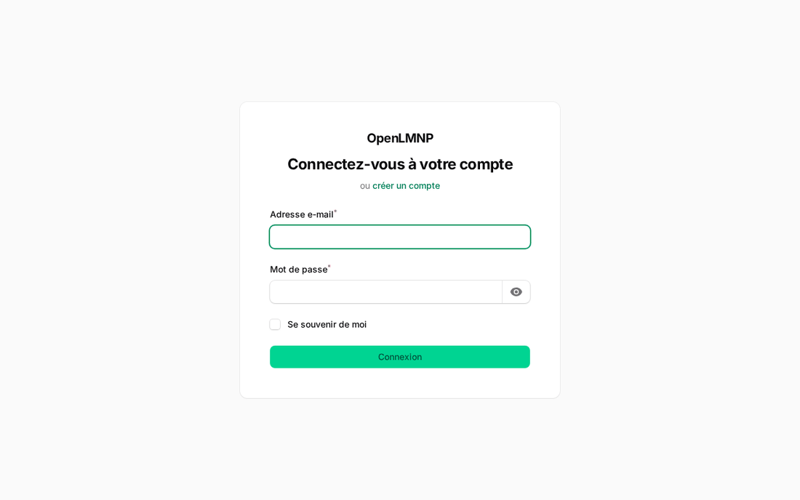
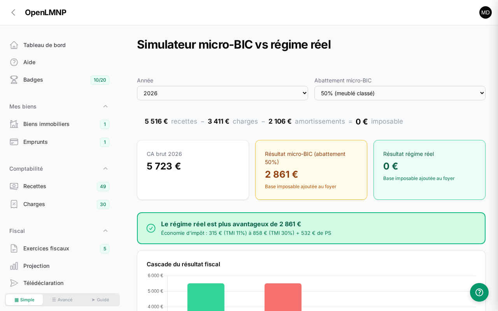
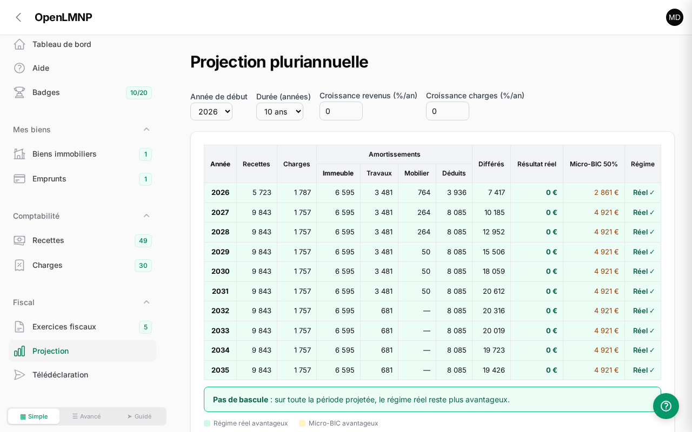

<div align="center">

# OpenLMNP

**Open source accounting software for French LMNP furnished rentals**

Manage your furnished rental properties, compute depreciation,
and produce your French tax return under the « régime réel » — no subscription, self-hosted.

[](https://github.com/manganate006/openlmnp/actions/workflows/tests.yml)
[](https://github.com/manganate006/openlmnp/releases)
[](LICENSE)


**[🚀 Live demo](https://app.openlmnp.fr)** · **[📦 Install](#quick-install-docker)** · **[📚 Documentation](#documentation)** · **[🇫🇷 Français](README.md)**



</div>

> **🎯 Try it without installing anything** — the [online demo](https://app.openlmnp.fr) spawns an
> ephemeral, isolated sandbox for each visitor, pre-filled with 4 years of fictional accounting.
> Login: `demo@openlmnp.fr` / `demo2026`.

## Table of contents

- [Why OpenLMNP?](#why-openlmnp)
- [Features](#features)
- [Screenshots](#screenshots)
- [Documentation](#documentation)
- [Quick install (Docker)](#quick-install-docker)
- [Proxmox LXC install](#proxmox-lxc-install-community-script)
- [Development install](#development-install)
- [Configuration](#configuration)
- [Tests](#tests)
- [Contributing](#contributing)
- [License](#license)

## Why OpenLMNP?

For a French furnished rental, the « régime réel » tax regime almost always beats the
micro-BIC flat allowance — but it requires component-based depreciation, a full tax return
(forms 2031, 2033) and a legally compliant FEC ledger. The usual options each have a flaw:

| | **OpenLMNP** | DIY spreadsheet | Accounting SaaS | Accountant |
|---|---|---|---|---|
| **Cost** | Free (AGPLv3) | Free | Yearly subscription | Yearly fees |
| **Your data** | At home (self-hosted) | At home | Third-party cloud | Third party |
| **Component depreciation** | ✅ Automatic | ⚠️ Formulas to maintain | ✅ | ✅ |
| **Tax return + FEC** | ✅ Generated | ❌ | ✅ | ✅ |
| **Cent-accurate math (bcmath)** | ✅ | ⚠️ Floating-point rounding | ✅ | ✅ |

OpenLMNP automates the « régime réel » end to end while remaining an **assistance tool**:
for complex situations (joint ownership, para-hotel VAT, switching to LMP status…), a
chartered accountant is still recommended.

## Features

### 🏠 Accounting & depreciation
- **Component-based depreciation** — structure, roof, plumbing, fittings (standard durations)
- **Works & furniture** — dedicated or prorated depreciation, new/second-hand handling
- **Loans** — automatic amortization schedule, deductible interest
- **Accounting entries** — generated automatically following the LMNP chart of accounts
- **Multi-property** — address, surfaces, main-residence share, market value

### 📋 Tax & filings
- **Chained fiscal years** — prior-year carryovers, deferred depreciation, capping rules
- **Micro-BIC vs régime réel simulator** — with a quantified verdict
- **Multi-year projection** — 5 to 20 year table, regime switch year
- **Interactive filing helper** — Cerfa 2031, 2033-A/B/C/D, 2042-C-PRO lines with "Copy" buttons
- **Tax return PDF** — full generation
- **Compliant FEC** — article A.47 A-1 of the French tax code, 18 columns, legal format

### 🔌 Import & integrations
- **Airbnb / Booking CSV import** — FR/EN formats, duplicate detection
- **CSV export** — income, expenses, filing lines
- **MCP API** — drive your accounting from an AI assistant (Claude, etc.)
- **Automatic updates** — notification and deployment from GitHub

### 🛡️ Comfort & safety
- **Multi-user** — each owner only ever sees their own data
- **Guided wizards** — onboarding, property creation, fiscal year closing, loan, yearly import
- **Receipts** — files attached to expenses, works and furniture
- **Built-in guide & progress badges** — getting started, regular bookkeeping, yearly filing
- **Dark mode** — native Filament
- **167 automated tests** — Pest PHP, 472 assertions ([details](docs/TESTS.md), in French)

## Screenshots

| Simulator | Projection | Filing helper |
|---|---|---|
| [](docs/screenshots/simulateur.png) | [](docs/screenshots/projection.png) | [](docs/screenshots/teledeclaration.png) |

More screenshots: [dashboard](docs/screenshots/dashboard.png) · [expenses](docs/screenshots/charges.png)

## Documentation

Documentation is written in French (the software targets French tax law):

| Document | Contents |
|----------|----------|
| [Installation](docs/INSTALLATION.md) | Self-hosting with Docker: build, run, persistent volumes, environment variables, updates and backups |
| [Features](docs/FONCTIONNALITES.md) | Component depreciation, FEC, 2031/2033 tax return, CSV import, simulator, multi-property, loans, receipts |
| [Demo mode](docs/DEMO.md) | Enable and use the multi-user demo mode (ephemeral per-visitor sandbox) |
| [FAQ](docs/FAQ.md) | Common questions: pricing, data privacy, régime réel vs micro-BIC, backups… |
| [LMNP / Airbnb tax guide](docs/fiscalite-lmnp-airbnb.md) | Régime réel tax rules: depreciation, allowances, caps, 2026 reform |
| [Test coverage](docs/TESTS.md) | Breakdown of the 167 automated tests, suite by suite |
| [UI design guide](docs/ui-design-openlmnp.md) | Design decisions behind the Filament interface |

To contribute, see [CONTRIBUTING.md](CONTRIBUTING.md).

## Tech stack

| Component | Technology |
|-----------|------------|
| Framework | Laravel 13 |
| Admin UI | Filament 5 |
| Interactivity | Livewire 4 |
| Database | SQLite (PostgreSQL optional) |
| PDF | DomPDF |
| Financial math | PHP bcmath (decimal precision) |
| Tests | Pest PHP |
| Deployment | Docker |

## Quick install (Docker)

```bash
git clone https://github.com/manganate006/openlmnp.git
cd openlmnp
docker build -t openlmnp .
docker run -d --name openlmnp -p 8090:8000 --restart unless-stopped openlmnp
```

Access: `http://localhost:8090`
Demo account: `demo@openlmnp.fr` / `demo2026`

## Proxmox LXC install (community script)

On a Proxmox VE host, spin up a ready-to-use LXC container with a single command:

```bash
bash -c "$(curl -fsSL https://raw.githubusercontent.com/manganate006/openlmnp/main/community-scripts/ct/openlmnp.sh)"
```

Debian 13 · nginx + PHP 8.4-FPM · SQLite. A **random** admin password is generated at
install time and stored in `/opt/openlmnp/admin_credentials.txt`.

> ℹ️ Requires a public repository with a published *release* (the script fetches the latest GitHub release).

## Development install

```bash
git clone https://github.com/manganate006/openlmnp.git
cd openlmnp
composer install
cp .env.docker .env
php artisan key:generate
touch database/database.sqlite
php artisan migrate:fresh --seed
php artisan serve
```

## Configuration

| Variable | Description | Default |
|----------|-------------|---------|
| `DB_CONNECTION` | Database | `sqlite` |
| `DB_DATABASE` | SQLite path | `database/database.sqlite` |
| `APP_LOCALE` | Language | `fr` |

Add your SIREN number in your user profile for tax documents.

## Tests

[](https://github.com/manganate006/openlmnp/actions/workflows/tests.yml)

**167 Pest PHP tests, 472 assertions** — calculation services, Filament pages, multi-user
isolation, demo mode. Suite-by-suite breakdown: [docs/TESTS.md](docs/TESTS.md).

```bash
# Run all tests
vendor/bin/pest

# By category
vendor/bin/pest --filter="Depreciation"
vendor/bin/pest --filter="FiscalYear"
vendor/bin/pest --filter="Filament"
```

## Contributing

Contributions are welcome! Please open an issue before submitting a PR.

```bash
# Fork + clone
git checkout -b feature/my-feature
# ... edit ...
vendor/bin/pest  # make sure tests pass
git commit -m "feat: description"
git push origin feature/my-feature
# Open a PR
```

## License

[AGPLv3](LICENSE) — Free software. You may use, modify and redistribute it,
provided modifications are shared under the same license.

## Credits

- [Laravel](https://laravel.com) — PHP framework
- [Filament](https://filamentphp.com) — Admin panel
- [Pest PHP](https://pestphp.com) — Testing framework

---

<div align="center">
<sub>OpenLMNP is an accounting assistance tool. It does not replace a chartered accountant for complex cases.</sub>
</div>
