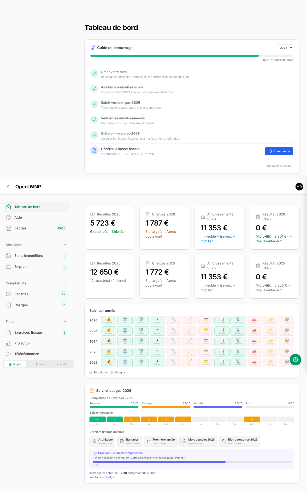
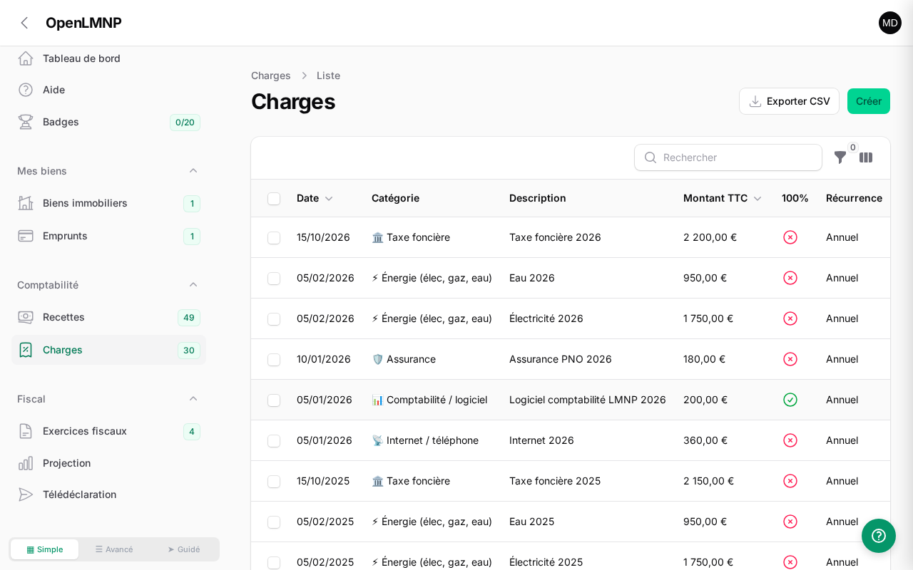
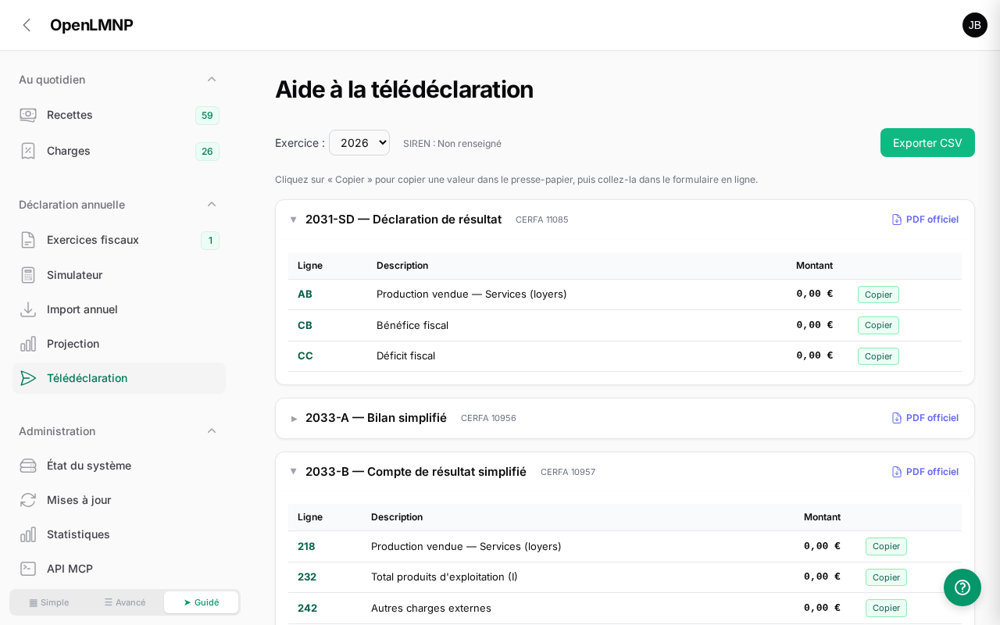

<div align="center">

# OpenLMNP

**Open-source accounting software for French furnished rentals (LMNP)**


Manage your rental properties, calculate depreciation,
and generate your tax return under the French real regime.

[Version française](README.md)

</div>

---

## Screenshots

<details>
<summary>Dashboard</summary>



</details>

<details>
<summary>Expenses</summary>



</details>

<details>
<summary>Tax return helper</summary>



</details>

## What is LMNP?

**LMNP** (Location Meublée Non Professionnelle) is the French tax regime for non-professional furnished rental property owners. OpenLMNP helps owners manage their accounting under the "régime réel" (actual expenses regime), which allows deducting real expenses and depreciation instead of a flat-rate deduction.

## Features

- **Multi-user** — Each owner sees only their own data
- **Properties** — Address, surfaces, quota share for primary residence, market value
- **Component depreciation** — Building structure, roof, plumbing, fittings (standard durations)
- **Works & Furniture** — Dedicated or prorated depreciation, new/second-hand with adapted receipts
- **Income** — Manual entry or Airbnb/Booking CSV import
- **Expenses** — Categorized, automatic prorata, receipt uploads
- **Loans** — Auto-generated amortization schedule, deductible interest
- **Simulator** — Micro-BIC vs real regime comparison with verdict
- **Multi-year projection** — 5 to 20 year table
- **Interactive tax return** — Cerfa lines 2031, 2033-A/B/C/D, 2042-C-PRO with "Copy" buttons
- **Tax return PDF** — Full generation
- **FEC compliant** — Article A.47 A-1 LPF, 18 columns, legal format
- **Accounting entries** — Auto-generated (French chart of accounts)
- **MCP API** — Integration with AI assistants (Claude, etc.)
- **Auto-updates** — Notification and deployment from GitHub
- **Guided wizards** — Onboarding, property creation, fiscal year closing, loan, annual import
- **CSV export** — Income, expenses, tax return
- **Dark mode** — Native Filament support
- **In-app documentation** — User guide organized in 3 phases: setup, regular tracking, annual declaration
- **102 automated tests** — Pest PHP, 266 assertions

## Tech Stack

| Component | Technology |
|-----------|-----------|
| Framework | Laravel 13 |
| Admin UI | Filament 5 |
| Reactivity | Livewire 4 |
| Database | SQLite (PostgreSQL optional) |
| PDF | DomPDF |
| Financial math | PHP bcmath (decimal precision) |
| Tests | Pest PHP |
| Deployment | Docker |

## Quick Start (Docker)

```bash
git clone https://github.com/manganate006/openlmnp.git
cd openlmnp
docker build -t openlmnp .
docker run -d --name openlmnp -p 8090:8000 --restart unless-stopped openlmnp
```

Access: `http://localhost:8090`
Demo account: `demo@openlmnp.fr` / `demo2026`

## Proxmox LXC install (community script)

On a Proxmox VE host, create a ready-to-use LXC container in one command:

```bash
bash -c "$(curl -fsSL https://raw.githubusercontent.com/manganate006/openlmnp/main/community-scripts/ct/openlmnp.sh)"
```

Debian 13 · nginx + PHP 8.4-FPM · SQLite. A **random** admin password is generated at install time
and saved to `/opt/openlmnp/admin_credentials.txt`.

> ℹ️ Requires a public repository with a published *release* (the script fetches the latest GitHub release).

## Development Setup

```bash
git clone https://github.com/manganate006/openlmnp.git
cd openlmnp
composer install
cp .env.docker .env
php artisan key:generate
touch database/database.sqlite
php artisan migrate:fresh --seed
php artisan serve
```

## Tests

```bash
vendor/bin/pest
```

102 tests, 266 assertions covering: depreciation calculations, fiscal result, loan amortization, Airbnb CSV import, FEC generation, accounting entries, badges, VAT, MCP API, all Filament pages, navigation, wizards, and data isolation between users.

## French Tax Context

This software generates documents aligned with French tax forms:

| Form | Purpose |
|------|---------|
| **2031-SD** | BIC income declaration |
| **2033-A** | Simplified balance sheet |
| **2033-B** | Simplified income statement (lines 218-372) |
| **2033-C** | Fixed assets and depreciation (lines 430-572) |
| **2033-D** | Reportable deficits |
| **FEC** | Accounting entries file (legal requirement) |
| **2042-C-PRO** | Personal income tax (cases 5NA/5NK) |

## License

[AGPLv3](LICENSE) — Free software. You can use, modify and redistribute it
as long as you share modifications under the same license.

## Credits

- [Laravel](https://laravel.com) — PHP Framework
- [Filament](https://filamentphp.com) — Admin panel
- [Pest PHP](https://pestphp.com) — Testing framework

---

<div align="center">
<sub>OpenLMNP is an accounting aid tool. It does not replace a professional accountant for complex cases.</sub>
</div>
