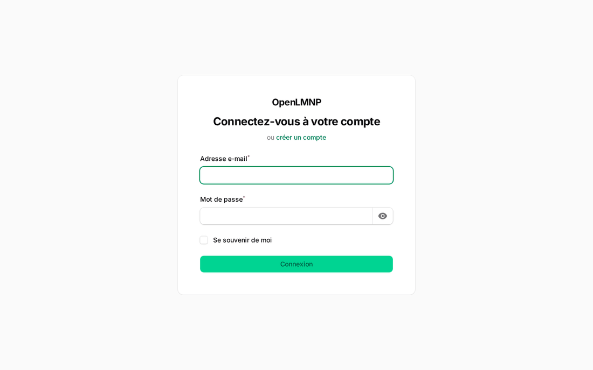
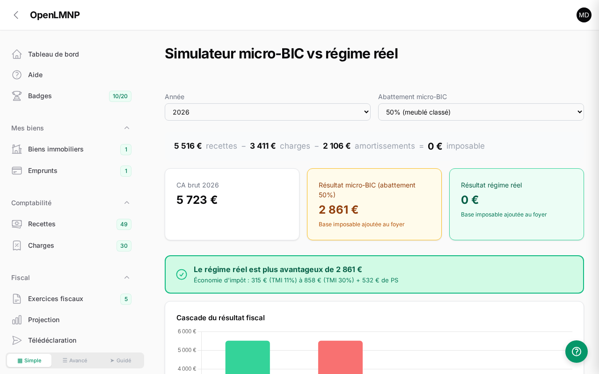
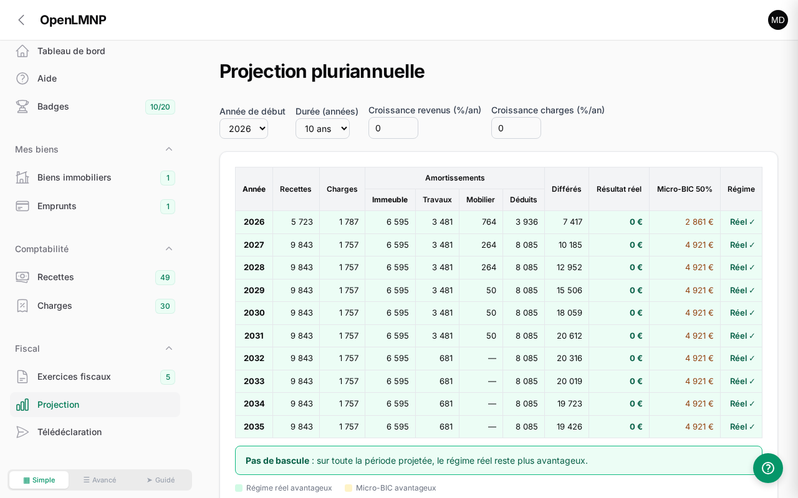
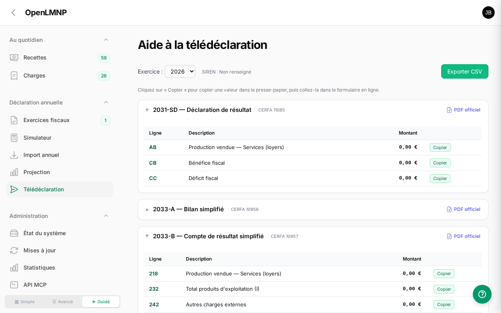

<div align="center">

# OpenLMNP

**Open source accounting software for French LMNP furnished rentals**

Manage your furnished rental properties, compute depreciation,
and produce your French tax return under the « régime réel », with no subscription and on your own server.

[](https://github.com/manganate006/openlmnp/actions/workflows/tests.yml)
[](https://github.com/manganate006/openlmnp/releases)
[](LICENSE)


**[🚀 Live demo](https://app.openlmnp.fr)** · **[📦 Install](#quick-install-docker)** · **[📚 Documentation](#documentation)** · **[🇫🇷 Français](README.md)**



</div>

> **🎯 Try it without installing anything**: the [online demo](https://app.openlmnp.fr) spawns an
> ephemeral, isolated sandbox for each visitor, pre-filled with several fiscal years of fictional accounting (since 2022).
> Login: `demo@openlmnp.fr` / `demo2026`.

## Table of contents

- [Why OpenLMNP?](#why-openlmnp)
- [Features](#features)
- [Screenshots](#screenshots)
- [Documentation](#documentation)
- [Quick install (Docker)](#quick-install-docker)
- [PaaS deployment](#paas-deployment-coolify-dokploy-easypanel)
- [Proxmox LXC install](#proxmox-lxc-install-community-script)
- [Development install](#development-install)
- [Configuration](#configuration)
- [Backup](#backup)
- [Tests](#tests)
- [Contributing](#contributing)
- [How to support us?](#-how-to-support-us)
- [Acknowledgements](#acknowledgements)
- [License](#license)

## Why OpenLMNP?

For a French furnished rental, the « régime réel » tax regime almost always beats the
micro-BIC flat allowance, but it requires component-based depreciation, a full tax return
(forms 2031, 2033) and a legally compliant FEC ledger. The usual options each have a flaw:

| | **OpenLMNP** | DIY spreadsheet | Accounting SaaS | Accountant |
|---|---|---|---|---|
| **Cost** | Free (AGPLv3) | Free | Yearly subscription | Yearly fees |
| **Your data** | At home (self-hosted) | At home | Third-party cloud | Third party |
| **Component depreciation** | ✅ Automatic | ⚠️ Formulas to maintain | ✅ | ✅ |
| **Tax return + FEC** | ✅ Generated | ❌ | ✅ | ✅ |
| **Cent-accurate math (bcmath)** | ✅ | ⚠️ Floating-point rounding | ✅ | ✅ |

OpenLMNP automates the « régime réel » end to end while remaining an **assistance tool**:
for complex situations (joint ownership, para-hotel VAT, switching to LMP status...), a
chartered accountant is still recommended.

## Features

### 🏠 Accounting & depreciation
- **Component-based depreciation**: structure, roof, plumbing, fittings (standard durations), split by percentage or by amount
- **Works & furniture**: dedicated or prorated depreciation, new/second-hand handling
- **Loans**: automatic amortization schedule, deductible interest
- **Recurring expenses**: monthly or quarterly instalments generated, one-click expense duplication
- **Accounting entries**: generated automatically following the LMNP chart of accounts
- **Multi-property**: address, surfaces, main-residence share, market value estimated from actual sales in the town (French DVF open data)
- **Take over existing books**: 5-step wizard starting from your accountant's last tax return, checked figure by figure

### 📋 Tax & filings
- **Chained fiscal years**: prior-year carryovers, deferred depreciation, capping rules, carried-forward losses tracking
- **Micro-BIC vs régime réel simulator**: with a quantified verdict
- **Multi-year projection**: 5 to 20 year table, regime switch year
- **Interactive filing helper**: Cerfa 2031, 2033-A/B/C/D, 2042-C-PRO lines with "Copy" buttons, filing date and receipt number recorded
- **Tax return PDF**: 2031-SD and 2033-A to D, "result breakdown" and "fixed assets" appendices, cross-form consistency checks
- **Compliant FEC**: article A.47 A-1 of the French tax code, 18 columns, legal format
- **VAT return**: for a VAT-registered property

### 🔌 Import & integrations
- **Airbnb / Booking CSV import**: FR/EN formats, duplicate detection; generic CSV import for income, expenses, furniture and works
- **CSV export**: income, expenses, filing lines
- **MCP API (45 tools)**: drive your accounting from an AI assistant (Claude, etc.)
- **New versions flagged**: in the app, based on GitHub releases (a Docker instance updates with `docker pull`)

### 🛡️ Comfort & safety
- **Multi-user**: each owner only ever sees their own data
- **Guided wizards**: onboarding, property creation, fiscal year closing, loan, yearly import
- **Receipts**: files attached to expenses, works and furniture, ZIP export
- **Built-in guide & progress badges**: getting started, regular bookkeeping, yearly filing
- **Diagnostic report**: everything behind your depreciation and tax return in one text, to report a calculation issue
- **Dark mode**: native Filament
- **Automated tests**: Pest PHP suite run on every push ([details](docs/TESTS.md), in French)

## Screenshots

| Simulator | Projection | Filing helper |
|---|---|---|
| [](docs/screenshots/simulateur.png) | [](docs/screenshots/projection.png) | [](docs/screenshots/teledeclaration.png) |

More screenshots: [dashboard](docs/screenshots/dashboard.png) · [expenses](docs/screenshots/charges.png)

## Documentation

Documentation is written in French (the software targets French tax law):

| Document | Contents |
|----------|----------|
| [Installation](docs/INSTALLATION.md) | Self-hosting with Docker: build, run, persistent volumes, environment variables, updates and backups |
| [Features](docs/FONCTIONNALITES.md) | Component depreciation, FEC, 2031/2033 tax return, CSV import, simulator, multi-property, loans, receipts |
| [Demo mode](docs/DEMO.md) | Enable and use the multi-user demo mode (ephemeral per-visitor sandbox) |
| [FAQ](docs/FAQ.md) | Common questions: pricing, data privacy, régime réel vs micro-BIC, backups... |
| [LMNP / Airbnb tax guide](docs/fiscalite-lmnp-airbnb.md) | Régime réel tax rules: depreciation, allowances, caps, 2026 reform |
| [Test coverage](docs/TESTS.md) | Breakdown of the automated tests, suite by suite |
| [UI design guide](docs/ui-design-openlmnp.md) | Design decisions behind the Filament interface |
| [Changelog](CHANGELOG.md) | New features and fixes, release by release |
| [Security](SECURITY.md) | Report a vulnerability privately |

To contribute, see [CONTRIBUTING.md](CONTRIBUTING.md).

## Tech stack

| Component | Technology |
|-----------|------------|
| Framework | Laravel 13 |
| Admin UI | Filament 5 |
| Interactivity | Livewire 4 |
| Database | SQLite (PostgreSQL optional) |
| PDF | DomPDF |
| Financial math | PHP bcmath (decimal precision) |
| Tests | Pest PHP |
| Deployment | Docker |

## Quick install (Docker)

Using the official [`manganate06/openlmnp`](https://hub.docker.com/r/manganate06/openlmnp) image:

```bash
docker run -d --name openlmnp -p 8090:8000 \
  -v openlmnp-database:/var/www/html/database \
  -v openlmnp-storage:/var/www/html/storage \
  --restart unless-stopped manganate06/openlmnp:latest
```

Or building the image from source, with the provided [`docker-compose.yml`](docker-compose.yml):

```bash
git clone https://github.com/manganate006/openlmnp.git
cd openlmnp
docker compose up -d
```

Access: `http://localhost:8090`
First login: create your account on `/register`: the first account becomes the
administrator, and sign-up then closes by itself.

## PaaS deployment (Coolify, Dokploy, Easypanel)

On a self-hosted PaaS, [`docker-compose.coolify.yml`](docker-compose.coolify.yml) gives a
ready-to-use deployment: domain, TLS certificate and reverse proxy are wired by the platform.
On Coolify: *New Resource* → *Docker Compose (Empty)*, paste the file, *Deploy*. Details and
caveats in [docs/INSTALLATION.md](docs/INSTALLATION.md#déploiement-sur-un-paas-coolify-dokploy-easypanel).

## Proxmox LXC install (community script)

On a Proxmox VE host, spin up a ready-to-use LXC container with a single command:

```bash
bash -c "$(curl -fsSL https://raw.githubusercontent.com/manganate006/openlmnp/main/community-scripts/ct/openlmnp.sh)"
```

Debian 13 · nginx + PHP 8.4-FPM · SQLite. A **random** admin password is generated at
install time and stored in `/opt/openlmnp/admin_credentials.txt`.

## Development install

```bash
git clone https://github.com/manganate006/openlmnp.git
cd openlmnp
composer install
cp .env.docker .env
php artisan key:generate
touch database/database.sqlite
php artisan migrate:fresh --seed
php artisan serve
```

## Configuration

On first visit, create your account at `/register`: it becomes the **administrator**, then the
registration page **closes automatically** (personal instance by default, tunable via
`ALLOW_REGISTRATION`). Then add your SIREN number in your profile for tax documents.

| Variable | Description | Default |
|----------|-------------|---------|
| `DB_CONNECTION` | Database | `sqlite` |
| `DB_DATABASE` | SQLite path | `database/database.sqlite` |
| `APP_URL` | Public address of the instance, scheme included (`https://lmnp.example.com`) | `http://localhost` |
| `TRUSTED_HOSTS` | Other host names accepted when `APP_URL` holds a domain (IP, aliases), comma-separated (otherwise error 400) | empty |
| `APP_LOCALE` | Language | `fr` |
| `ALLOW_REGISTRATION` | Registration: `auto` (until first account), `true` (always), `false` (never) | `auto` |
| `FEEDBACK_ENABLED` | One-off invitation to give feedback on the software (see below) | `true` |
| `TELEMETRY_ENABLED` | Anonymous daily ping (random identifier + version) to count installed instances; no accounting or personal data | `true` |
| `DVF_ENABLED` | Market value estimate button; on click only, it queries data.gouv.fr with the property's town | `true` |

### Giving feedback (and how to turn it off)

After a while of real use, the app asks **once** what you think of the software: a thumb, and
a word if you like. It is the only feedback a project built in spare time gets.

**Nothing leaves your instance.** Without `FEEDBACK_FORWARD_EMAIL`, your feedback is simply
stored in your own database; the confirmation screen then offers to send it yourself, from
your mail client, if you want to. No automatic sending, no outgoing call.

To turn it off completely:

```bash
FEEDBACK_ENABLED=false
```

Thresholds can be tuned without touching the code: `FEEDBACK_MIN_SECONDS` (240),
`FEEDBACK_MIN_ACTIONS` (1), `FEEDBACK_COOLDOWN_DAYS` (30), `FEEDBACK_AUDIENCES`.

### Emails (optional)

No email is sent by default (`MAIL_MAILER=log`), and the app works fine without. To enable the
"Forgot password" link, plug in any SMTP provider via the `MAIL_*` variables (the sender is
your own address; SPF/DKIM are handled by your provider). And if you forget your password
without SMTP, from the server:

```bash
php artisan openlmnp:reset-password you@example.com
```

📖 **Full reference**: all variables, persistent volumes, accounts, step-by-step SMTP,
backups: [docs/INSTALLATION.md](docs/INSTALLATION.md)

## Backup

Everything lives in two volumes: `database` (the SQLite database) and `storage` (your
receipts). The database runs in WAL mode: **do not copy `database.sqlite` while the instance
is running**, the copy would silently lose its latest writes. Take a consistent snapshot with
`sqlite3 database.sqlite ".backup 'snapshot.sqlite'"`, or stop the container before copying.
Full procedure and restore: [docs/INSTALLATION.md](docs/INSTALLATION.md#sauvegarde-et-restauration).

## Tests

[](https://github.com/manganate006/openlmnp/actions/workflows/tests.yml)

Pest PHP suite run on every push: calculation services, tax return and FEC, Filament pages,
multi-user isolation, demo mode. Suite-by-suite breakdown: [docs/TESTS.md](docs/TESTS.md).

```bash
# Run all tests
vendor/bin/pest

# By category
vendor/bin/pest --filter="Depreciation"
vendor/bin/pest --filter="FiscalYear"
vendor/bin/pest --filter="Filament"
```

## Contributing

Contributions are welcome! Please open an issue before submitting a PR, and read
[CONTRIBUTING.md](CONTRIBUTING.md). Security vulnerabilities must be reported **privately**,
never in a public issue: see [SECURITY.md](SECURITY.md).

```bash
# Fork + clone
git checkout -b feature/my-feature
# ... edit ...
vendor/bin/pest  # make sure tests pass
git commit -m "feat: description"
git push origin feature/my-feature
# Open a PR
```

## 💛 How to support us?

OpenLMNP is developed in my free time. If the tool is useful to you, here's how you
can help keep it going:

- ⭐ **Star the repo**: it helps other furnished-rental landlords discover the project
- 💛 **Become a sponsor** via [GitHub Sponsors](https://github.com/sponsors/manganate006): a few euros a month fund development time
- 🐛 **Report a bug** or suggest a feature via [issues](https://github.com/manganate006/openlmnp/issues)
- 🔧 **Contribute code**: see [CONTRIBUTING.md](CONTRIBUTING.md)

Thanks to everyone who supports the project!

## Acknowledgements

OpenLMNP owes a lot to the people who installed it, tried it on their own books and told
us what was wrong: [@cocool97](https://github.com/cocool97),
[@ptitzgeg-on-git](https://github.com/ptitzgeg-on-git), [@ovrtn](https://github.com/ovrtn)
and [@DamienFr](https://github.com/DamienFr). Their contributions (fixes, reports, security)
are listed on the [acknowledgements page](https://openlmnp.fr/remerciements) (in French).

## License

[AGPLv3](LICENSE), free software. You may use, modify and redistribute it,
provided modifications are shared under the same license.

## Credits

- [Laravel](https://laravel.com): PHP framework
- [Filament](https://filamentphp.com): admin panel
- [Pest PHP](https://pestphp.com): testing framework

---

<div align="center">
<sub>OpenLMNP is an accounting assistance tool. It does not replace a chartered accountant for complex cases.</sub>
</div>
