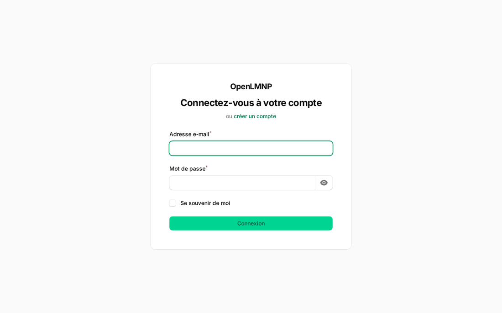
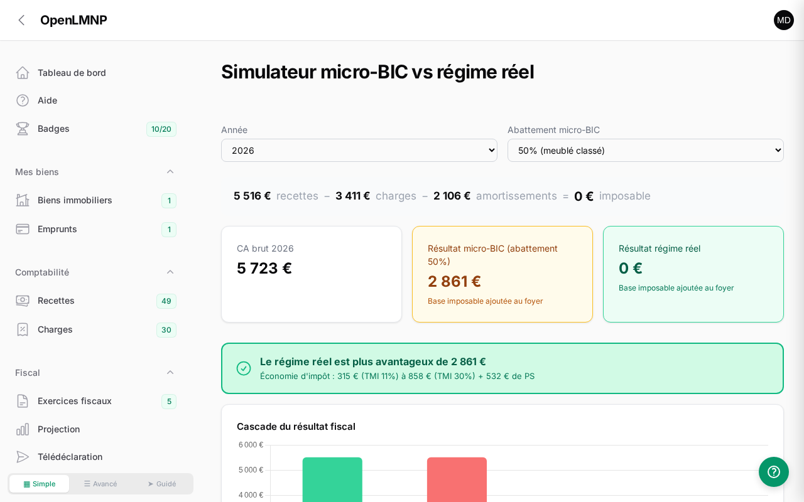
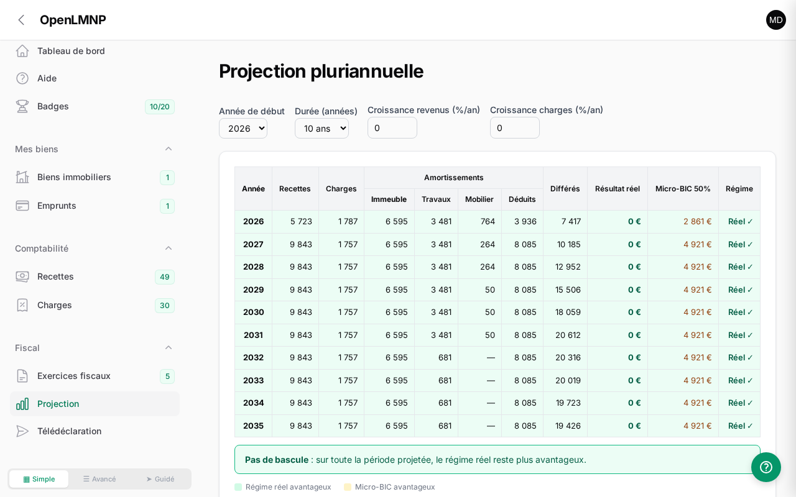
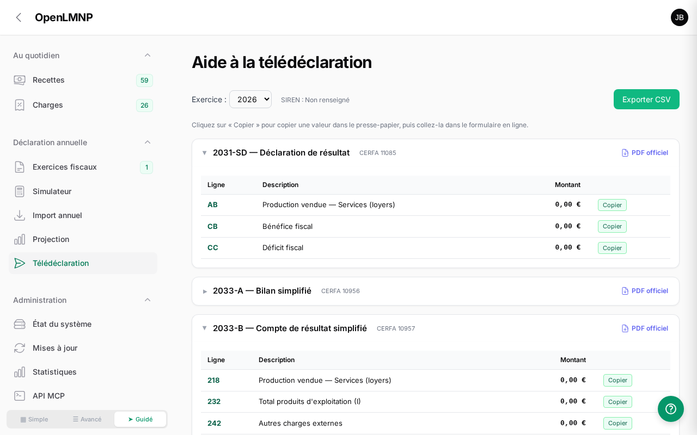

<div align="center">

# OpenLMNP

**Logiciel open source de comptabilité LMNP (Location Meublée Non Professionnelle)**

Gérez vos biens en location meublée, calculez vos amortissements,
et produisez votre liasse fiscale au régime réel — sans abonnement, chez vous.

[](https://github.com/manganate006/openlmnp/actions/workflows/tests.yml)
[](https://github.com/manganate006/openlmnp/releases)
[](LICENSE)


**[🚀 Démo live](https://app.openlmnp.fr)** · **[📦 Installation](#installation-rapide-docker)** · **[📚 Documentation](#documentation)** · **[🇬🇧 English](README.en.md)**



</div>

> **🎯 Essayez sans rien installer** — la [démo en ligne](https://app.openlmnp.fr) crée un bac à sable
> éphémère et isolé pour chaque visiteur, pré-rempli avec 4 années de comptabilité fictive.
> Connexion : `demo@openlmnp.fr` / `demo2026`.

## Sommaire

- [Pourquoi OpenLMNP ?](#pourquoi-openlmnp-)
- [Fonctionnalités](#fonctionnalités)
- [Captures d'écran](#captures-décran)
- [Documentation](#documentation)
- [Installation rapide (Docker)](#installation-rapide-docker)
- [Installation LXC Proxmox](#installation-lxc-proxmox-script-communautaire)
- [Installation développement](#installation-développement)
- [Configuration](#configuration)
- [Tests](#tests)
- [Contribution](#contribution)
- [Comment nous soutenir ?](#comment-nous-soutenir-)
- [Licence](#licence)

## Pourquoi OpenLMNP ?

Le régime réel LMNP est presque toujours plus avantageux que le micro-BIC pour un meublé,
mais il exige des amortissements par composant, une liasse fiscale (2031, 2033) et un FEC
conforme. Les options habituelles ont chacune leur défaut :

| | **OpenLMNP** | Tableur maison | SaaS comptable | Expert-comptable |
|---|---|---|---|---|
| **Coût** | Gratuit (AGPLv3) | Gratuit | Abonnement annuel | Honoraires annuels |
| **Vos données** | Chez vous (auto-hébergé) | Chez vous | Cloud d'un tiers | Chez un tiers |
| **Amortissements par composant** | ✅ Automatiques | ⚠️ Formules à maintenir | ✅ | ✅ |
| **Liasse fiscale + FEC** | ✅ Générés | ❌ | ✅ | ✅ |
| **Calculs au centime (bcmath)** | ✅ | ⚠️ Arrondis flottants | ✅ | ✅ |

OpenLMNP automatise le régime réel de bout en bout et reste un **outil d'aide** : pour les
situations complexes (indivision, TVA para-hôtelière, passage en LMP…), un expert-comptable
reste recommandé.

## Fonctionnalités

### 🏠 Comptabilité & amortissements
- **Amortissement par composant** — gros œuvre, toiture, plomberie, agencements (durées standards)
- **Travaux & mobilier** — amortissement dédié ou au prorata, gestion neuf/occasion
- **Emprunts** — tableau d'amortissement automatique, intérêts déductibles
- **Écritures comptables** — génération automatique selon le plan comptable LMNP
- **Multi-biens** — adresse, surfaces, quote-part résidence principale, valeur vénale

### 📋 Fiscal & déclarations
- **Exercices chaînés** — reports N−1, amortissements différés, plafonnement
- **Simulateur micro-BIC vs régime réel** — avec verdict chiffré
- **Projection pluriannuelle** — tableau sur 5 à 20 ans, année de bascule des régimes
- **Télédéclaration interactive** — lignes Cerfa 2031, 2033-A/B/C/D, 2042-C-PRO avec boutons « Copier »
- **Liasse fiscale PDF** — génération complète
- **FEC conforme** — article A.47 A-1 du LPF, 18 colonnes, format légal

### 🔌 Import & intégrations
- **Import CSV Airbnb / Booking** — formats FR/EN, détection des doublons
- **Export CSV** — recettes, charges, télédéclaration
- **API MCP (44 outils)** — pilotez votre comptabilité depuis un assistant IA (Claude, etc.)
- **Mises à jour automatiques** — notification et déploiement depuis GitHub

### 🛡️ Confort & sécurité
- **Multi-utilisateurs** — chaque propriétaire voit uniquement ses données
- **Assistants guidés** — onboarding, création de bien, clôture fiscale, emprunt, import annuel
- **Justificatifs** — pièces uploadées sur charges, travaux et mobilier
- **Guide intégré & badges de progression** — mise en route, suivi régulier, déclaration annuelle
- **Dark mode** — natif Filament
- **234 tests automatisés** — Pest PHP, 629 assertions ([détail](docs/TESTS.md))

## Captures d'écran

| Simulateur | Projection | Télédéclaration |
|---|---|---|
| [](docs/screenshots/simulateur.png) | [](docs/screenshots/projection.png) | [](docs/screenshots/teledeclaration.png) |

D'autres captures : [tableau de bord](docs/screenshots/dashboard.png) · [charges](docs/screenshots/charges.png)

## Documentation

| Document | Contenu |
|----------|---------|
| [Installation](docs/INSTALLATION.md) | Auto-hébergement via Docker : build, run, volumes de persistance, variables d'environnement, mise à jour et sauvegarde |
| [Fonctionnalités](docs/FONCTIONNALITES.md) | Amortissement par composant, FEC, liasse fiscale 2031/2033, import CSV, simulateur, multi-biens, emprunts, justificatifs |
| [Mode démonstration](docs/DEMO.md) | Activer et utiliser le mode démo multi-utilisateurs (sandbox éphémère isolé par visiteur) |
| [FAQ](docs/FAQ.md) | Questions courantes : gratuité, confidentialité des données, régime réel vs micro-BIC, sauvegardes… |
| [Guide fiscal LMNP / Airbnb](docs/fiscalite-lmnp-airbnb.md) | Règles fiscales du régime réel : amortissements, abattements, plafonds, réforme 2026 |
| [Couverture de tests](docs/TESTS.md) | Détail des 234 tests automatisés, suite par suite |
| [Guide de conception UI](docs/ui-design-openlmnp.md) | Choix de design de l'interface Filament |

Pour contribuer au projet, voir [CONTRIBUTING.md](CONTRIBUTING.md).

## Stack technique

| Composant | Technologie |
|-----------|-------------|
| Framework | Laravel 13 |
| Admin UI | Filament 5 |
| Interactivité | Livewire 4 |
| Base de données | SQLite (PostgreSQL en option) |
| PDF | DomPDF |
| Calculs financiers | PHP bcmath (précision décimale) |
| Tests | Pest PHP |
| Déploiement | Docker |

## Installation rapide (Docker)

Avec l'image officielle [`manganate06/openlmnp`](https://hub.docker.com/r/manganate06/openlmnp) :

```bash
docker run -d --name openlmnp -p 8090:8000 \
  -v openlmnp-database:/var/www/html/database \
  -v openlmnp-storage:/var/www/html/storage \
  --restart unless-stopped manganate06/openlmnp:latest
```

Ou en construisant l'image depuis les sources :

```bash
git clone https://github.com/manganate006/openlmnp.git
cd openlmnp
docker build -t openlmnp .
docker run -d --name openlmnp -p 8090:8000 --restart unless-stopped openlmnp
```

Accès : `http://localhost:8090`
Compte démo : `demo@openlmnp.fr` / `demo2026`

## Installation LXC Proxmox (script communautaire)

Sur un hôte Proxmox VE, crée un conteneur LXC prêt à l'emploi en une seule commande :

```bash
bash -c "$(curl -fsSL https://raw.githubusercontent.com/manganate006/openlmnp/main/community-scripts/ct/openlmnp.sh)"
```

Debian 13 · nginx + PHP 8.4-FPM · SQLite. Un mot de passe admin **aléatoire** est généré à
l'installation et enregistré dans `/opt/openlmnp/admin_credentials.txt`.

> ℹ️ Nécessite un dépôt public avec une *release* publiée (le script récupère la dernière release GitHub).

## Installation développement

```bash
git clone https://github.com/manganate006/openlmnp.git
cd openlmnp
composer install
cp .env.docker .env
php artisan key:generate
touch database/database.sqlite
php artisan migrate:fresh --seed
php artisan serve
```

## Configuration

À la première visite, créez votre compte sur `/register` : il devient
**administrateur**, puis la page d'inscription **se referme automatiquement**
(instance personnelle par défaut — réglable via `ALLOW_REGISTRATION`).
Ajoutez ensuite votre SIREN dans votre profil pour les documents fiscaux.

| Variable | Description | Défaut |
|----------|-------------|--------|
| `DB_CONNECTION` | Base de données | `sqlite` |
| `DB_DATABASE` | Chemin SQLite | `database/database.sqlite` |
| `APP_LOCALE` | Langue | `fr` |
| `ALLOW_REGISTRATION` | Inscription : `auto` (jusqu'au premier compte), `true` (toujours), `false` (jamais) | `auto` |
| `FEEDBACK_ENABLED` | Invitation ponctuelle à donner son avis sur le logiciel (voir ci-dessous) | `true` |

### Donner son avis (et comment l'éteindre)

Après un moment d'utilisation réelle, l'application propose **une fois** de dire ce que vous
pensez du logiciel : un pouce, et si vous le souhaitez un mot. C'est le seul retour que reçoit
un projet développé sur du temps libre.

**Rien ne quitte votre instance.** Sans `FEEDBACK_FORWARD_EMAIL`, votre retour est simplement
enregistré dans votre propre base ; l'écran de confirmation vous propose alors de l'envoyer
vous-même, par votre client mail, si vous en avez envie. Aucun envoi automatique, aucun appel
sortant.

Pour la désactiver complètement :

```bash
FEEDBACK_ENABLED=false
```

Les seuils sont réglables sans toucher au code : `FEEDBACK_MIN_SECONDS` (240),
`FEEDBACK_MIN_ACTIONS` (1), `FEEDBACK_COOLDOWN_DAYS` (30), `FEEDBACK_AUDIENCES`.

### Emails (optionnel)

Aucun email ne part par défaut (`MAIL_MAILER=log`) — l'application fonctionne très
bien sans. Pour activer le lien « Mot de passe oublié », branchez le SMTP de votre
choix via les variables `MAIL_*` (l'expéditeur est votre propre adresse ; SPF/DKIM
sont gérés par votre fournisseur). Et en cas d'oubli sans SMTP, depuis le serveur :

```bash
php artisan openlmnp:reset-password vous@exemple.fr
```

📖 **Référence complète** — toutes les variables, volumes de persistance, comptes,
SMTP pas à pas, sauvegarde : [docs/INSTALLATION.md](docs/INSTALLATION.md)

## Tests

[](https://github.com/manganate006/openlmnp/actions/workflows/tests.yml)

**234 tests Pest PHP, 629 assertions** — services de calcul, pages Filament, isolation
multi-utilisateurs, mode démo. Détail suite par suite : [docs/TESTS.md](docs/TESTS.md).

```bash
# Lancer tous les tests
vendor/bin/pest

# Par catégorie
vendor/bin/pest --filter="Depreciation"
vendor/bin/pest --filter="FiscalYear"
vendor/bin/pest --filter="Filament"
```

## Contribution

Les contributions sont les bienvenues ! Merci d'ouvrir une issue avant de soumettre une PR.

```bash
# Fork + clone
git checkout -b feature/ma-fonctionnalite
# ... modifier ...
vendor/bin/pest  # vérifier que les tests passent
git commit -m "feat: description"
git push origin feature/ma-fonctionnalite
# Ouvrir une PR
```

## 💛 Comment nous soutenir ?

OpenLMNP est développé sur mon temps libre. Si l'outil vous rend service, voici comment
m'aider à continuer :

- ⭐ **Mettez une étoile** sur le repo — ça aide d'autres loueurs meublés à découvrir le projet
- 💛 **Devenez sponsor** via [GitHub Sponsors](https://github.com/sponsors/manganate006) — quelques euros par mois financent le temps de développement
- 🐛 **Signalez un bug** ou proposez une fonctionnalité via les [issues](https://github.com/manganate006/openlmnp/issues)
- 🔧 **Contribuez du code** — voir [CONTRIBUTING.md](CONTRIBUTING.md)

Merci à toutes celles et ceux qui soutiennent le projet !

## Licence

[AGPLv3](LICENSE) — Logiciel libre. Vous pouvez l'utiliser, le modifier et le redistribuer
à condition de partager les modifications sous la même licence.

## Crédits

- [Laravel](https://laravel.com) — Framework PHP
- [Filament](https://filamentphp.com) — Admin panel
- [Pest PHP](https://pestphp.com) — Framework de tests

---

<div align="center">
<sub>OpenLMNP est un outil d'aide à la comptabilité. Il ne remplace pas un expert-comptable pour les cas complexes.</sub>
</div>
